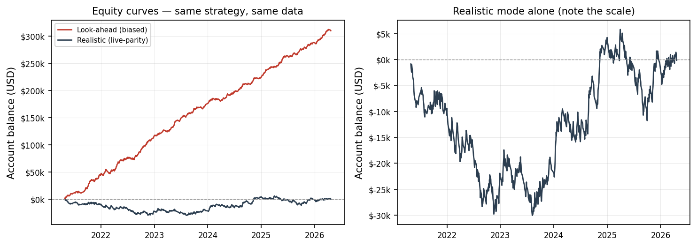

# LiquidityBot — Automated Futures Trading System

A real-time algorithmic trading bot for micro E-mini S&P 500 futures (MES),
built around an ICT-style liquidity strategy. Connects to the TopstepX broker,
processes live market data, and executes bracket orders automatically — with a
matching offline backtester and replay system that run the *same* strategy code.

This is an engineering project. It demonstrates real-time market-data handling,
broker integration, deterministic backtesting, and — importantly — the discovery
and correction of a look-ahead bias that was inflating the strategy's results.

## What it does

- Streams 1-minute and 5-minute bars from TopstepX over WebSocket
- Runs a state-machine strategy engine (sweep → break-of-structure → retracement → entry)
- Places **bracket orders** (limit entry + stop-loss + take-profit as OCO) automatically
- Manages risk, position sizing, and a daily trade limit
- Logs every bar and state transition for full forensic traceability
- Backtests the identical engine over years of historical data
- Replays captured live bars to verify live/backtest parity bar-for-bar

## Architecture

```
Live market data (TopstepX WebSocket)
        │  1m + 5m bars
        ▼
  Bar drainer  ── debounce + canonical ordering (5m before 1m at a tie)
        ▼
  Strategy engine (engine.py)  ── WAITING → SWEPT → CONFIRMED_SHIFT → RETRACED → entry
        │  signal
        ▼
  Bracket executor  ── LIMIT entry, then STOP + LIMIT (OCO) once filled
        ▼
  Broker (TopstepX)  ── order goes to market
        │  fill events
        ▼
  Risk manager + journal  ── sizing, P&L state, trade log
```

Everything is captured to `bars/*.jsonl` (every bar seen) and `ict_bot.log`
(every state transition), so any decision can be reconstructed after the fact.

## Why it processes bars carefully

The live WebSocket delivers a 5-minute bar only when it *closes* — five minutes
after it opened. A naive backtest, by contrast, can hand the engine a completed
5-minute bar at its open timestamp, letting the strategy "see the future." That
gap was the source of a major **look-ahead bias**.

- The live bot uses a debounced drainer that orders simultaneous bars
  deterministically (5m before 1m at the same timestamp), matching the offline
  tools exactly.
- The backtester (`backtest_replay.py`) defaults to **realistic live-delivery
  ordering** so its results reflect what would actually happen live. A
  `--lookahead-mode` flag reproduces the old inflated numbers purely to
  demonstrate the size of the bias.

Discovering this was the most valuable outcome of the project: the original
backtest looked far more profitable than the strategy actually is, and only
realistic bar-delivery simulation revealed the true (much more modest) edge.

## Results — measuring the bias

Both runs below use the **same strategy code, the same data, the same date range,
and the same transaction costs**. The only difference is the bar-delivery ordering
described above. Five years of MES, 2021-04-23 → 2026-04-22:

| Metric | Realistic (live-parity) | Look-ahead (biased) |
|:---|---:|---:|
| Trades | 643 | 711 |
| Win rate | 35.3% | 55.6% |
| **Net P&L** | **−$159.51** | **+$309,783.83** |
| Profit factor | 1.00 | 2.43 |
| Max drawdown | $30,050.87 | $7,925.11 |



One sort key separates a strategy that appears to earn **$309,784** from one that
actually earns **−$159**. Note that the bias does not merely inflate the total — it
also raises the win rate, *lowers* drawdown, and changes which trades are taken at
all (711 vs. 643), which is why it cannot be corrected after the fact.

**A full write-up of this experiment — mechanism, methodology, and limitations —
is in [CaseStudy.pdf](CaseStudy.pdf).**

The honest takeaway: under realistic simulation this strategy has no meaningful
edge. The value of this repo is the **engineering** — real-time data pipelines,
broker integration, deterministic backtesting, live/replay parity, and the rigor
to find a bias most backtests never catch.

## Layout

| File | Purpose |
|---|---|
| `run.py` | Live trading entry point — orchestrates broker, engine, execution, risk |
| `engine.py` | Strategy engine (`ICTEngine`) — the sweep/BOS/retracement state machine |
| `replay.py` | Re-run the engine over captured or historical bars (no live trading) |
| `backtest_replay.py` | Multi-year backtester with realistic-delivery default |
| `broker/base.py` | Broker abstraction (`BrokerAdapter` interface) |
| `broker/topstepx.py` | TopstepX implementation of the adapter |
| `journal.py` | Trade logging to CSV |
| `config.example.json` | Configuration template (copy to `config.json`) |
| `risk_state.example.json` | Shape of the persisted risk/P&L state file |
| `trades.example.csv` | Column schema of the trade journal, with sample rows |
| `ict_trades.example.jsonl` | Shape of the engine's entry-event log (same sample trades) |

## Setup

Requires **Python 3.10+** (developed on 3.14).

```bash
pip install -r requirements.txt        # or: pip install project_x_py pytz
cp config.example.json config.json     # then fill in your TopstepX credentials
```

`config.json` holds your API key and is **gitignored** — never commit it. The
bot reads credentials from there (or from `PROJECT_X_*` environment variables).

`risk_state.json` (persisted P&L / risk state), `trades.csv` (the trade journal),
and `ict_trades.jsonl` (the engine's entry-event log) are created automatically on
first run and are also gitignored, since they contain account data. The `.example`
versions of all three are committed purely to document their format — you do not
need to copy them.

### Historical data

The backtester needs 1-minute OHLCV bars; 5-minute bars are synthesized from them
automatically. It accepts CSV, Parquet, or zstd-compressed CSV, and recognizes both
the Databento schema (`ts_event, open, high, low, close, volume, symbol`) and any
generic file with `datetime/timestamp/date` plus OHLCV columns.

The results above use MES data licensed from Databento (`GLBX.MDP3`, `ohlcv-1m`
schema). **That data is not included in this repository** — CME market-data
licensing prohibits redistribution. New Databento accounts receive free credits
sufficient to pull an equivalent dataset. Any vendor with the columns above should
work, though only Databento has been tested.

## Usage

```bash
# Backtest the strategy over historical 1-minute data (realistic delivery by default)
python3 backtest_replay.py --file-1m data.csv --start 2021-01-01 --end 2026-01-01 --fees

# Demonstrate the look-ahead bias for comparison (inflated, unrealistic numbers)
python3 backtest_replay.py --file-1m data.csv --start 2021-01-01 --end 2026-01-01 --fees --lookahead-mode

# Replay a captured live session bar-for-bar
python3 replay.py --from-bar-log bars/2026-05-22.jsonl

# Run live (requires configured TopstepX account)
python3 run.py
```

> **Note on `--combine` / `--xfa`:** these simulate prop-firm account rules and stop
> trading permanently the first time the balance hits the maximum loss limit
> (−$2,000). That is correct for simulating a funded evaluation, but it makes them
> unsuitable for measuring a strategy's edge over a multi-year window — the run
> ends at the first drawdown. Omit them for research backtests.

## Security

`config.json`, logs, captured bars, and account state are gitignored. Credentials
are never hardcoded. If you fork this, set your own credentials in `config.json`
or via environment variables and rotate any key that has ever been exposed.

## Disclaimer

**This software places real orders with real money. Use it at your own risk.**

It is published for educational and portfolio purposes. Nothing here is financial
advice, and nothing here is a recommendation to trade any instrument. Futures
trading carries substantial risk of loss and is not suitable for every investor;
you can lose more than your initial deposit.

As documented in the Results section above, this strategy is **not profitable**
under realistic simulation — it is roughly break-even before considering the
additional slippage, outages, and execution differences that live trading brings.
Do not run it with money you cannot afford to lose. The software is provided "as
is," without warranty of any kind, and the author accepts no liability for any
losses arising from its use.

## License

MIT — see [LICENSE](LICENSE).
